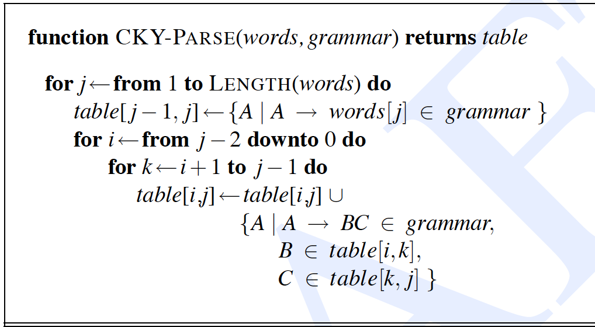
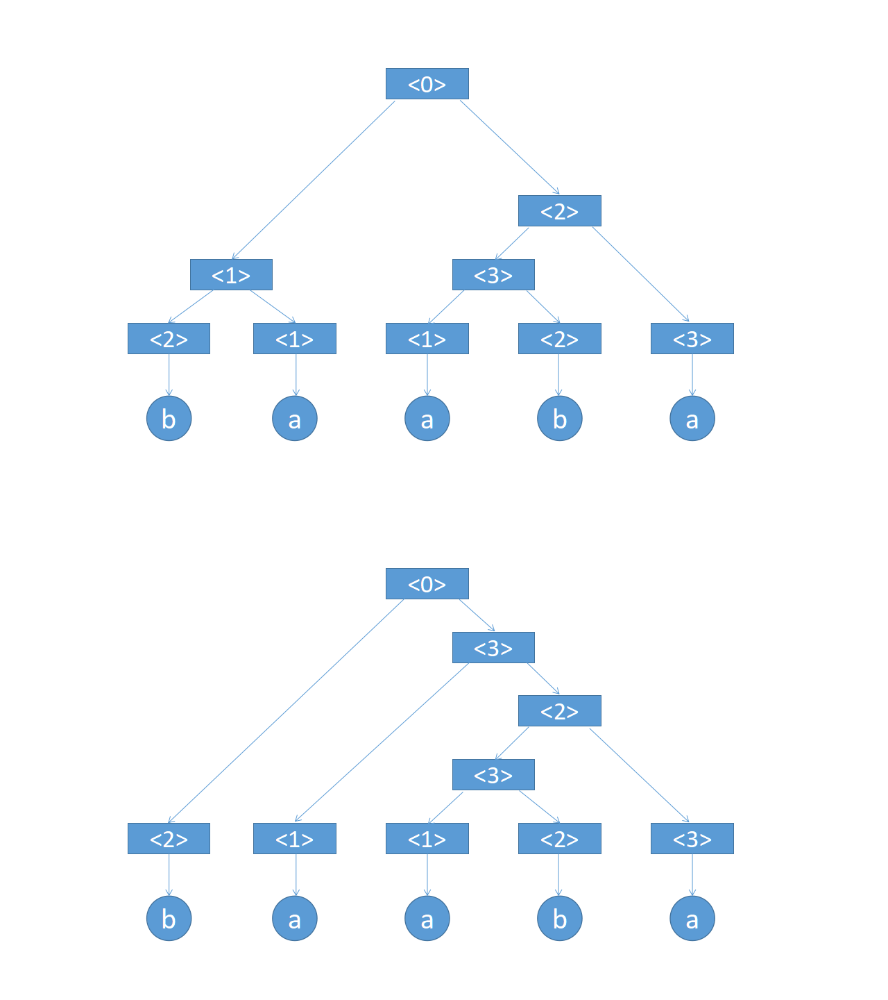

## 问题描述

CYK 算法（Cocke–Younger–Kasami algorithm，缩写为 CYK algorithm）是由约翰·科克、Younger 和嵩忠雄共同研究出来大约发表于 1965 年的一个算法，它是一个用来判定任意给定的字符串 w 是否属于一个上下文无关文法的算法。普通的回溯法在最坏的情况下需要指数时间才能解决这样的问题，而 CYK 算法只需要多项式时间就够了(O(n^3)， n 为字符串 w 的长度）。CYK 算法采用了动态规划的思想，其伪代码描述如下：



本大作业提供了串行代码与数据样例，请同学们在串行代码的基础上完成代码并行化。

串行代码仅供参考，也可以自己编写效率更高的串行代码，成绩同样有效。

不要尝试修改算法，因为编译原理课上讲的算法不能处理二义性文法，测试用例给定的文法都是有二义性的上下文无关文法。

不可对文法进行化简，这会导致结果不正确。

## 输入形式

从"input.txt"读入

第一行是一个整型，表示非终结符的数量 vn_num

第二行是一个整型，表示“右侧是两个非终结符的产生式”的数量 production2_num，即代码中的 Production2 类型的数量

接下来 production2_num 行，每行是一个 Production2 类型，非终结符的格式是"<%d>"，数字范围是 0 到(production2_num-1)，"<0>"表示开始符号

然后下一行是一个整型，表示“右侧是一个终结符的产生式”的数量 production1_num，即代码中的 Production1 类型的数量

接下来 production1_num 行，每行是一个 Production1 类型，终结符的格式是"%c"，范围是所有可打印的 ASCII 字符

然后下一行是一个整型，表示被测试的字符串的长度

最后一行是被测试的字符串

## 输出形式

一个 32 位无符号整型，表示被测试的字符串能构成多少棵符合文法的语法树，语法树的数量可能很多，为了简单起见，若发生溢出就截取低 32 位

## 输入样例

```
4
5
<0>::=<1><2>
<0>::=<2><3>
<1>::=<2><1>
<2>::=<3><3>
<3>::=<1><2>
3
<1>::=a
<2>::=b
<3>::=a
5
baaba
```

## 输出样例

```
2
```

## 样例说明

输入样例中的文法和字符串可以构成两棵语法树，如图所示：


