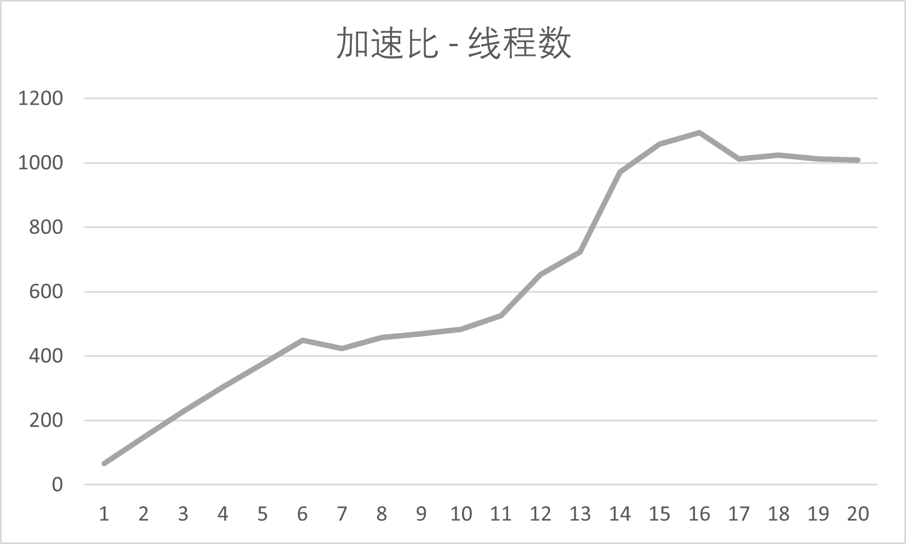

# 实验报告

> 学号：19373718 
>
> 姓名：周勤

## 实现细节

### 作业初期遇到的问题

作业初期遇到的问题不算多，首先是希冀平台已经给出的串行代码逻辑比较复杂，而且没有注释，比较难读懂，刚开始读的时候会觉得**“这个代码的逻辑怎么这么乱”**。我第一遍读串行代码，读到一半就不读了，直接去Google上查了[CYK算法](https://en.wikipedia.org/wiki/CYK_algorithm)的具体原理以及大概的应用，明确了这是一个$O(n^3)$的区间dp之后，就直接开始写自己的串行代码了。

其次是并行方案的选择，这个我并没有花很久时间，基本上是从Pthreads、MPI、OpenMP三个里选一个。虽然我没有测试过，但是我先直接排除掉了MPI，因为MPI是多进程并行，速度上限是没有多线程高的。在Pthreads和OpenMP中，我最后选择了**OpenMP**，虽然Pthreads对于线程的控制粒度更小，但是这也意味着我必须要自己编写更多复杂的多线程相关代码，我最终并没有选择上限更高的Pthreads。

### 如何将任务进行分块

程序实现大致分为四个部分：**读入数据**、**数据预处理**、**区间dp**、**输出结果**。其中数据的读入和输出是不能并行的，数据预处理和区间dp都是可以进行并行计算的。而区间dp实际上占了绝大部分程序的运行时间，所以区间dp的并行化尤为重要，区间dp的串行伪代码如下：

```c++
// 枚举区间长度
for(int len = 2;len <= slen;++len){
    // 枚举区间左端点
    for(int left = 0;left <= slen - len;++left){
        int right = left + len - 1;
        // 枚举区间中的点
        for(int mid = left;mid < right;++mid){
            update_based_on_len(); // 更具体的细节不再给出
        }
    }
}
```

这是很经典的一个区间dp，在CYK算法中最外层的`len`（区间长度）循环是有**循环依赖**的，必须按照从小到大的顺序进行最外层的循环。但是`left`和`mid`的循环都是没有循环依赖的，可以进行并行，我使用了如下的OpenMP编译指令进行并行计算：

````c++
#pragma omp parallel for schedule(dynamic)
````

上面这条指令会在运行时动态地为每个线程分配计算任务，每个线程计算完当前任务后会继续计算新的任务，详情请查阅[OpenMP手册](https://www.openmp.org/wp-content/uploads/OpenMP3.1.pdf)（编译大作业使用的GCC版本为4.8.5，这个版本的GCC支持的是OpenMP 3.1）。对于数据预处理部分，我也采用了类似的编译指令进行并行计算。至此，我已经完成了大作业代码**最初始**的版本，初始的代码非常短，可以贴出来：

```c++
#include <cstdio>
using namespace std;

const int MAX_PRODUCTION2_NUM = 512;
const int MAX_PRODUCTION1_NUM = 128;
const int MAX_VN = 128;
const int MAX_VT = 128;
const int MAX_SLEN = 1024;

int vn_num, p2_num, p1_num, slen;
int p2[MAX_PRODUCTION2_NUM][3];
int p1[MAX_PRODUCTION1_NUM][2];
char str[MAX_SLEN];
int dp[MAX_SLEN][MAX_SLEN][MAX_VN];

int main() {
  freopen("input.txt", "r", stdin);
  scanf("%d\n", &vn_num);
  scanf("%d\n", &p2_num);
  for (int i = 0; i < p2_num; i++)
    scanf("<%d>::=<%d><%d>\n", &p2[i][0], &p2[i][1], &p2[i][2]);
  scanf("%d\n", &p1_num);
  for (int i = 0; i < p1_num; i++) scanf("<%d>::=%c\n", &p1[i][0], &p1[i][1]);
  scanf("%d\n", &slen);
  scanf("%s\n", str);

  #pragma omp parallel for schedule(dynamic)
  for (int i = 0; i < slen; ++i) {
    // 枚举所有Production1的规则
    for (int k = 0; k < p1_num; ++k) {
      if (str[i] == p1[k][1]) dp[i][i][p1[k][0]] = 1;
    }
  }

  for (int len = 2; len <= slen; ++len) {
    #pragma omp parallel for schedule(dynamic)
    for (int start = 0; start <= slen - len; ++start) {
      int end = start + len - 1;
      for (int mid = start; mid < end; ++mid) {
        // 枚举所有Production2的规则
        for (int i = 0; i < p2_num; ++i) {
          dp[start][end][p2[i][0]] +=
              dp[start][mid][p2[i][1]] * dp[mid + 1][end][p2[i][2]];
        }
      }
    }
  }

  printf("%u\n", dp[0][slen - 1][0]);
  return 0;
}
```

### 如何实现更大的加速比

上面这个最初始的版本有**很多不足**的地方，为了实现更高的加速比，我做了一些优化。本节提及的优化均是对于区间dp的优化，因为区间dp占了绝大部分的程序运行时间，其他的优化在这里就**不一一列出**了。

#### 减少写内存的次数

在区间dp的最内层循环中，**每次**都要对三维数组进行写入，即对`dp[start][end][p2[i][0]]`进行写入，我们可以将相同`parent`的产生式的结果都先加出来，最后再写入`dp[start][end][p2[i][0]]`，这样可以加速程序执行，核心代码如下：

```c++
// 枚举每一个非终结符
for (int i = 0; i < vn_num; ++i) {
  int sum = 0;
  // 将结果先加到sum中
  for (int j = 1; j < p22[i][0]; j += 2) {
    sum += dp[start][mid][p22[i][j]] * dp[mid + 1][end][p22[i][j + 1]];
  }
  // 最后再写内存
  dp[start][end][i] += sum;
}
```

#### 实现按需枚举

有些时候，枚举所有Production2并不是最优的，因为存在非终结符并不能推导出特定子串的情况。这种情况下，枚举所有Production2可能会计算很多次`0 × 0`，更关键的是增加了很多次三维数组的无效读写，这是非常致命的。可以通过**按需枚举**的方式来避免这种情况，希冀平台上的代码就是完全的按需枚举，大概思路是，记录下`s.substring(i,j)`可以由哪些非终结符推导出来，当计算区间$[k,j](k<i)$或者$[i,k](k>j)$时，就可以枚举记录下来的非终结符，使用特定的Production2直接得出结果，伪代码如下：

```c++
// 枚举可以推导出s.substring(start,mid)的非终结符
for(auto vn1: vn_set[start][mid]){
    // 枚举可以推导出s.substring(mid+1,end)的非终结符
    for(auto vn2: vn_set[mid+1][end]){
        // 枚举两个child分别是vn1和vn2的Production2
        for(auto production: pset[vn1][vn2]){
            // 使用production更新dp数组
            update_dp_with_production();
            // 更新可以推导出s.substring(start,end)的非终结符集合
            update_vn_set();
        }
    }
}
```

#### 使用数组模拟STL

我在大作业的迭代过程中，使用数组**代替**了`vector`和`bitset`，进一步加快了大作业的执行速度。直接使用STL确实十分方便，但是使用STL的执行速度并没有直接使用数组快，我将数组的第一个元素作为`vector`长度，其余的元素作为`vector`中的数字，这样可以模拟`vector`。至于`bitset`，可以用位运算和数组进行模拟，这里就不贴出代码了，而且由于题目的数据范围限制，只需要**128**位的`bitset`，我使用了两个64位的无符号整数进行模拟。

#### 对于缓存命中的优化

对于非终结符比较少的情况，可以**减小**dp数组第三维的大小，以此来提高缓存命中的概率。由于区间dp的最内层循环对dp数组的内存操作比较频繁（最耗时的操作**没有之一**），所以可以通过提高缓存命中率的相关优化加快程序的执行。我通过这一优化，使得我的大作业对于一些特定的用例，执行速度提高了**2**倍左右，事实上，如果继续进行缓存相关的优化，可以将执行速度加速得更快。

## 分析与实验

### 程序运行时间的测量

为了实际测量程序的运行时间，我使用了C++的**chrono**标准库，计算了从程序开始到结束的时间。这一部分的代码如下：

```c++
using namespace std;
using namespace std::chrono;
// 计时开始
steady_clock::time_point t1 = steady_clock::now();
// 计时结束
steady_clock::time_point t2 = steady_clock::now();
duration<double> time_span = duration_cast<duration<double>>(t2 - t1);
printf("Total Time: %fs\n", time_span.count());
```

需要注意的是，使用OpenMP时**不能**采用`clock()`函数来计时，因为`clock()`函数测量的是处理器的CPU时间，详情见[这里](https://blog.csdn.net/hqh45/article/details/50959296)，使用`clock()`函数的结果除以线程数的测量方法也是错误的。

### 加速比与线程数的关系

下面，给出对于**第一个测试用例**，程序加速比与线程数的关系图：（希冀平台的串行代码运行时间为258.264s，图中的加速比是相对于希冀平台的串行代码而言的）



最终的目标机是**16核**的，所以使用16线程可以获得最高的加速比。在**1至16线程**的范围内，程序的加速比大致随着线程数的增加而线性增加，因为在这个区间内，CPU会将每个线程放在不同的核上执行。而当线程的数量**高于16**时，程序的加速比开始缓慢下降，可以预见到，当创建的线程继续增大时，程序的加速比将会继续下降。另外，程序在单线程时的加速比为**66.830**，充分说明了重新写的串行代码的优越性。

## 结论

### 最终的实现方案

如前文所述，我最终提交的代码中包括了**按需枚举**、**缓存优化**、**数组模拟STL**、**减少写内存次数**等优化，代码总行数大概在**250行**左右。最重要的优化都围绕最内层循环展开，优化的核心思想是：**在算法层面**减少循环的总次数，**在指令层面**减少最内层循环中执行的指令的总开销，**在硬件层面**尽量使得CPU缓存命中，**在并行层面**能写成并行就不要写成串行。虽然对于比较小的计算任务，并行计算的通信开销可能比较大，但是这次大作业的计算量相对较大，计算开销远远大于通信开销。

### 仍可以改进的地方

- 在不影响空间局部性的前提下，微调循环逻辑，让小循环永远在外层
- 对于缓存作进一步的优化，增加缓存命中的概率，继续优化空间局部性
- 动态适应应该采用的算法，从按需计算和枚举中动态选择，或者对于特定的数据采用超参数
- 对于排序的部分采用并行，这一部分占用的时间极小，所以我的实现并没有使用并行
- 使用Pthreads对程序进行重写，进一步减小无效计算开销

程序的优化是**没有极限**的，除此之外一定还有可以优化的地方，这里就不再发散了。
