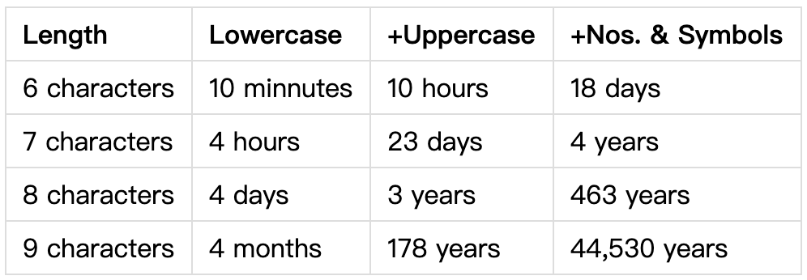

## 问题背景

一般来说，用户的密码都是经 MD5 哈希处理后存放在数据库里的。由于 MD5 是不可逆的，当你拿到一串被 MD5 处理过的字串，只能使用暴力破解的方式穷举所有的可能密码并生成 MD5 字串，然后和数据库里存储的 MD5 值进行对比。若得到的 MD5 值相同，那么该用户的密码就被破解出来了。

下表列出了密码的复杂程度及其对应的暴力破解所需的时间。（第一列是密码长度，第二列是全小写的密码，第三列是有大写字母的密码，第四列是又加上了数字和其它字符的密码）



如果你想知道自己的密码需要多少时间可以被破解，你可以访问[这个网站](http://howsecureismypassword.net/)。

上表中列出的时间是指串行暴力破解所需的时间，若利用并行程序破解密码，上表中的时间就可大大缩短了。

## 问题描述

设计一个暴力破解 MD5 密码的多进程程序。该程序从标准输入读入一长为 32 的字符串，该字符串为用户密码的 MD5 编码。破解成功后，程序在标准输出上打印该 MD5 值所对应的用户密码。已知，用户密码长度为 4 位，仅由小写字母和数字组成。请使用 MPI 来解决此问题。

注意阅读 `lib/md5driver.c` 中的 `void MDString(char*)` 函数，稍微修改该函数就可以生成并打印 MD5 编码。

## 输入形式

从控制台（标准输入）读入一个长为 32 的字符串，该字符串为用户密码的 MD5 编码

## 输出形式

向控制台（标准输出）打印用户密码

## 输入样例

```
5d8f7ad81bcce4f3fd4ce5a1d0365d59
```

## 输出样例

```
a123
```
